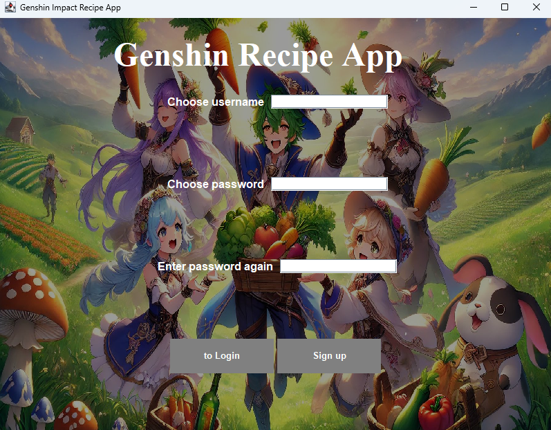
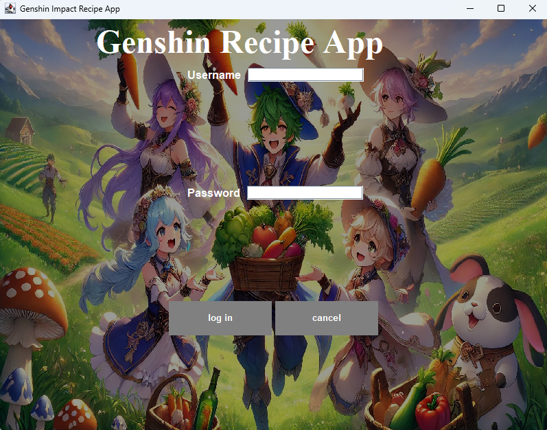
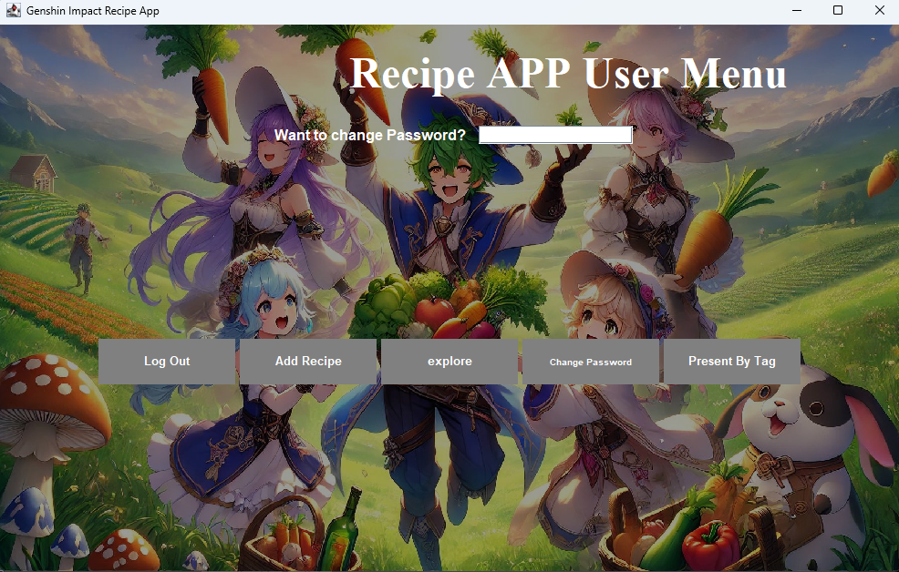
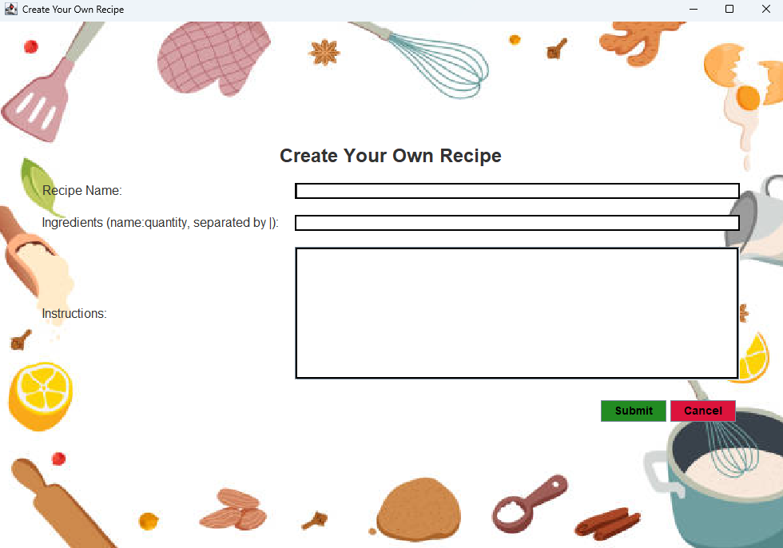
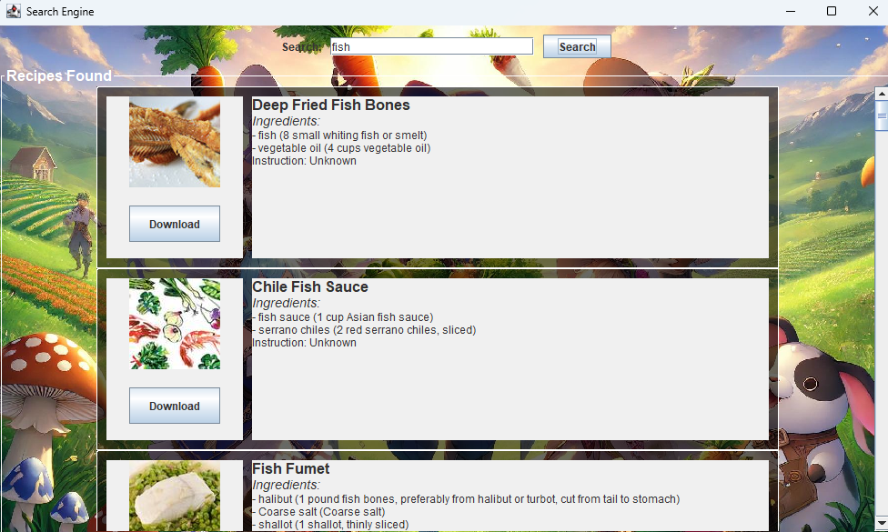
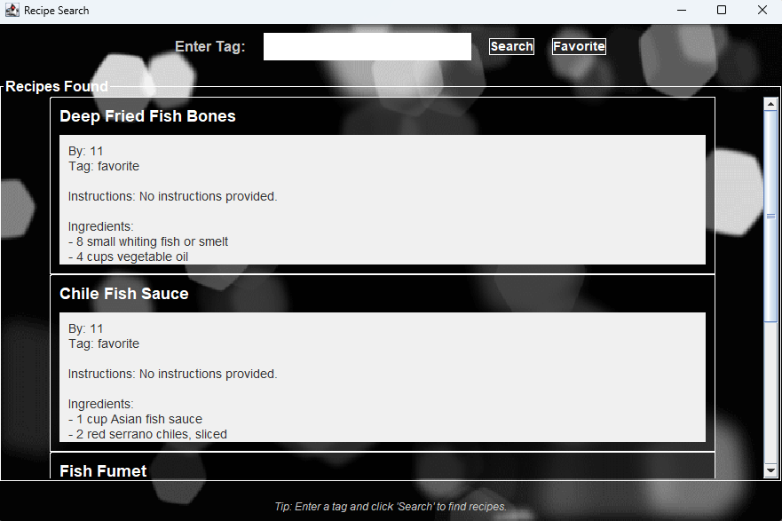

# Recipe App

**CSC207 Group 13**

**Team Name**: Genshin Impact

The purpose of this project is to create a recipe organizer application that allows users to manage their recipes effectively, explore new recipes, and get recommendations based on their preferences and available ingredients. This project aims to provide an easy and accessible way for users to organize meal planning, discover new culinary ideas, and accommodate dietary needs. The goal is to solve the problem of keeping track of various recipes, managing meal types, and finding suitable recipes based on individual needs.

Domain: Recipe Organizer, Management, and Recommendation

## Table of Contents
- [Contributors](#contributors)
- [Features](#features)
- [Installation Instructions](#installation-instructions)
- [Usage Guide](#usage-guide)
- [Entities](#entities)
- [License](#license)
- [Feedback](#feedback)
- [Contributing](#contributing)
## Contributors

- Tim(Zhouquan) Liu

- Pengze Ai

- Yi Chen Liu

- Yinjunnan Xiong

## Features

The app provides many usages such as:
- Signup and Login: Users can create an account by creating an username and password.
- Search and find recipes: Logged in the app, users can search and find recipes based on the keyword they typed in the search bar.
- Download recipes: Logged in the app and after finding the recipe using search, users can download the recipe so they can access it later.
- View created and downloaded recipes: Logged in the app, users can view the recipes they have created or downloaded by searching the tag.

## Installation Instructions

**Software Requirements**: A computer with IntelliJ IDEA (community or professional) installed and minimum Java8 (preferably more recent versions)

1) Clone the repository from GitHub. This can be done two ways.
   - Through IntelliJ IDEA by following the steps:
      - Navigate to the right page: Projects > Get from VCS > Repository URL
      - Enter the git repository URL in the "URL" text field:
     ```bash
        https://github.com/Txem/CSC207-Final-Project.git
     ```
      - Click on the "Clone" clone button

   - Through terminal by entering the following:
     ```bash
     git clone https://github.com/Txem/CSC207-Final-Project.git
     ```
2) Open the project on the IntelliJ IDEA.
3) Navigate to the "Main" file found in the "app" folder by following the steps:
   - csc207-final-project [homework-5] > src > main > java > app > Main.java
4) Navigate to the Edit Configurations, set the environment variable to be "token= your Adamam API app key"
5) Replace the appid in data_access/ApiExploreDataAccessObject.java by your app key
6) Run the app!

## Usage Guide
- Run **Main** to start the program.

### Sign up

- Sign up an account by entering your information and click the **Sign up** button.  

- If you already have an account, click **to Login** to continue.

### Log in

- Enter your username and password that you created preciously and click **log in**.  

- You can also close the app by clicking cancel.

### Logged in

- Once logged in this should be the page you see

### Create your own recipe

- Create your own recipe by entering the right information and click on **submit** once done.  

- You can delete this recipe by clicking on **cancel**.

### Searching recipes

- Explore recipes by a keyword in the search bar at the top and click **search**.  

- Scroll using the bar at the right to explore more related recipes.  

- Click on the image if you want to see the full recipe.  

- If you are interested in a recipe, click on **Download** to save it.

### Present by Tag

- Enter "Local" to display all the recipes you create.
- Enter "favorite" to display all the downloaded recipes.
- Alternatively, you can click on **Favorite** to display all the downloaded recipes.

### Change Password

- Change your password by entering your new password in the input field and click on **Change Password** to save the changes.

## Entities

### 1. Recipe:

Instance Variables:

name: The name of the recipe.

ingredients: A list of ingredients required for the recipe.

instructions: The steps required to prepare the dish.

category: Type of meal (e.g., breakfast, lunch, dinner, dessert).

dietary_preferences: Tags for dietary preferences (e.g., vegetarian, vegan).

### 2. User:

Instance Variables:

username: The name of the user.

saved_recipes: A list of recipes that the user has saved as favorites.

created_recipes: A list of recipes that the user has personally created.

### 3. Ingredient:

Instance Variables:

name: The name of the ingredient.

quantity: The amount required.

unit: The unit of measurement (e.g., grams, cups).

### 4. Category:

Instance Variables:

name: The name of the category (e.g., breakfast, lunch).

description: A description of the type of recipes in this category.

### 5. Search:

Instance Variables:

ingredient_list: A list of ingredients provided for searching.

category: The type of recipe being searched for.

dietary_preference: Dietary preferences to filter search results.

Features

The main features of the recipe organizer software include:

Recipe Management: Add, edit, and delete recipes.

Categorization: Categorize recipes by meal type and dietary preferences.

Search Functionality: Search for recipes by ingredients, name, or category.

Favorites: Save favorite recipes for easy access.

Recipe Suggestions: Get recipe recommendations based on available ingredients.

## License
Copyright (c) 2024 GenshinImpact Recipe App

Permission is hereby granted, free of charge, to any person obtaining a copy of this software and associated documentation files(the
"Software"), to deal in Software without restriction, including without limitation the rights to use, copy, modify, merge, publish, distribute, sublicense, and/or sell copies
of the Software, and to permit persons to whom the Software is furnished to do so, subject to the following conditions:

The above copyright notice and this permission notice shall be included in all copies or substantial portion of the Software.

THE SOFTWARE IS PROVIDED "AS IS", WITHOUT WARRANTY OF ANY KIND, EXPRESS OR IMPLIED, INCLUDING BUT NOT LIMITED TO THE WARRANTIES OF MERCHANTABILITY, FITNESS FOR A PARTICULAR PURPOSE
AND NONINFRINGEMENT. IN NO EVENT SHALL THE AUTHORS OR COPYRIGHT HOLDERS BE LIABLE FOR ANY CLAIM, DAMAGES OR OTHER LIABILITY, WHETHER IN AN ACTION OF CONTRACT, TORT OR OTHERWISE, RISING FROM, OUT OF OR IN CONNECTION WITH THE SOFTWARE
OR THE USE OR OTHER DEALINGS IN THE SOFTWARE.

## Feedback

To share your thoughts:
- Fill out this [Feedback Form](https://docs.google.com/forms/d/e/1FAIpQLSeJ7eKl9mG9IAEzGKsWucKaj6m61UzXcv7WiYCe1CEnuLBgyA/viewform?usp=sf_link)
with your comments or suggestions.

## Contributing
1. Fork this repository.
2. Create a new branch.
3. Submit a pull request.

### Guidelines
- Please follow clean architecture principles.
- Test your code beforehand.
- Describe your code.